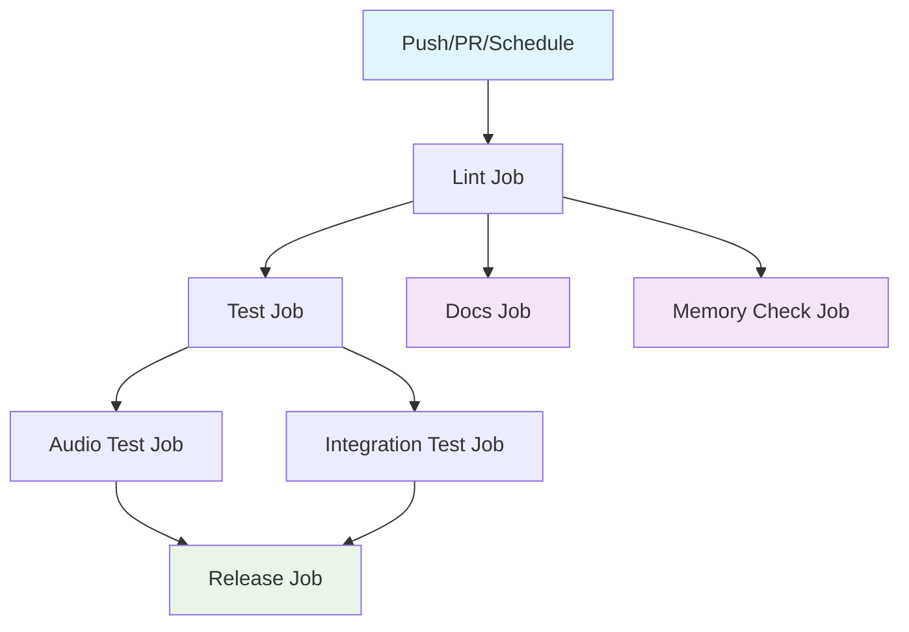

## Workflow Overview

**Purpose**: Automate testing, validation, and quality assurance for the MI7 investment intelligence system

**Trigger Events**:
- Push to `main` or `master` branches (Python files, requirements, config changes)
- Pull requests to `main` or `master` branches
- Daily scheduled run at 9 AM UTC

**Target Environments**: Ubuntu Linux (GitHub Actions runners)

## Execution Flow Diagram



## Jobs & Dependencies

| Job Name | Purpose | Dependencies | Execution Context |
|----------|---------|--------------|-------------------|
| lint | Code quality checks | None | ubuntu-latest |
| test | Run test suite | lint | ubuntu-latest |
| test-audio | Test audio generation features | test | ubuntu-latest |
| integration-test | Integration tests | test | ubuntu-latest |
| docs | Build documentation | lint | ubuntu-latest |
| memory-check | Validate memory system | lint | ubuntu-latest |
| release | Create GitHub release | test, integration-test | ubuntu-latest |

## Requirements Matrix

### Functional Requirements

| ID | Requirement | Priority | Acceptance Criteria |
|----|-------------|----------|-------------------|
| REQ-001 | All Python code must pass flake8 linting | High | No E9,F63,F7,F82 errors |
| REQ-002 | Tests must pass on Python 3.10, 3.11, 3.12 | High | 100% test success rate |
| REQ-003 | Audio generation tests must pass | Medium | Both edge-tts and ElevenLabs tests |
| REQ-004 | Memory validation must pass | Medium | All memory files valid |
| REQ-005 | Integration tests must pass | High | RSS and collector integration |

### Security Requirements

| ID | Requirement | Implementation Constraint |
|----|-------------|---------------------------|
| SEC-001 | Secrets must use GitHub Secrets | ANTHROPIC_API_KEY in secrets |
| SEC-002 | No hardcoded credentials | Credentials via environment only |

### Performance Requirements

| ID | Metric | Target | Measurement Method |
|----|-------|--------|-------------------|
| PERF-001 | Test execution time | < 5 minutes | GitHub Actions log |
| PERF-002 | Coverage report | > 80% | codecov report |

## Input/Output Contracts

### Inputs

```yaml
# Environment Variables
ANTHROPIC_API_KEY: secret  # Purpose: AI analysis API access
PYTHON_VERSION: '3.11'     # Purpose: Default Python version

# Repository Triggers
paths:
  - '**.py'
  - 'requirements.txt'
  - 'config/**'
branches:
  - main
  - master

# Schedule
cron: '0 9 * * *'  # Daily at 9 AM UTC
```

### Outputs

```yaml
# Job Outputs
test_results: junit-xml     # Description: Pytest results
coverage_report: xml        # Description: Code coverage data
release_asset: tag          # Description: GitHub release tag
```

### Secrets & Variables

| Type | Name | Purpose | Scope |
|------|------|---------|-------|
| Secret | ANTHROPIC_API_KEY | AI analysis API | Workflow |
| Secret | GITHUB_TOKEN | Release creation | Workflow |
| Variable | PYTHON_VERSION | Default Python version | Workflow |

## Execution Constraints

### Runtime Constraints

- **Timeout**: 10 minutes per job
- **Concurrency**: 20 parallel jobs max
- **Resource Limits**: GitHub Actions default (2-core, 7GB RAM)

### Environmental Constraints

- **Runner Requirements**: Ubuntu latest
- **Network Access**: External API access required (PyPI, codecov)
- **Permissions**: Contents read, Actions read, Secrets read

### Matrix Strategy

- **Python versions**: 3.10, 3.11, 3.12
- **Test parallelization**: By Python version

## Error Handling Strategy

| Error Type | Response | Recovery Action |
|------------|----------|-----------------|
| Lint Failure | Mark job failed | Fix code style issues |
| Test Failure | Mark job failed | Investigate test failures |
| Audio Test Failure | Continue (non-blocking) | Log warning for review |
| Integration Failure | Mark job failed | Check external services |
| Coverage Upload Failure | Continue | Log warning, manual upload |

## Quality Gates

### Gate Definitions

| Gate | Criteria | Bypass Conditions |
|------|----------|-------------------|
| Code Quality | flake8 passes | None (required) |
| Test Coverage | > 80% | None (required) |
| Audio Tests | All pass | On external service failure |
| Memory Validation | All files valid | None (required) |

## Monitoring & Observability

### Key Metrics

- **Success Rate**: > 95% of runs pass
- **Execution Time**: < 10 minutes total
- **Test Coverage**: > 80% code coverage

### Alerting

| Condition | Severity | Notification Target |
|-----------|----------|-------------------|
| Test failure on main | High | Repository maintainers |
| Coverage drop > 10% | Medium | Development team |
| Scheduled run failure | Low | DevOps team |

## Integration Points

### External Systems

| System | Integration Type | Data Exchange | SLA Requirements |
|--------|------------------|---------------|------------------|
| PyPI | Package download | pip install | 99.9% uptime |
| Codecov | Coverage upload | XML report | Best effort |
| GitHub API | Release creation | REST API | GitHub SLA |

### Dependent Workflows

| Workflow | Relationship | Trigger Mechanism |
|----------|--------------|-------------------|
| release | Dependent on test & integration | Automatic on main branch success |

## Compliance & Governance

### Audit Requirements

- **Execution Logs**: 90 days retention (GitHub default)
- **Approval Gates**: None for automated pipeline
- **Change Control**: PR review required for workflow changes

### Security Controls

- **Access Control**: Repository-level permissions
- **Secret Management**: GitHub Secrets with automatic masking
- **Vulnerability Scanning**: Dependabot alerts enabled

## Edge Cases & Exceptions

### Scenario Matrix

| Scenario | Expected Behavior | Validation Method |
|----------|-------------------|-------------------|
| Missing ANTHROPIC_API_KEY | Tests skip AI-dependent features | Environment check |
| External API timeout | Retry with exponential backoff | Test logs |
| Large PR with many files | Incremental testing | Path filter |
| Weekend scheduled run | Normal execution | Schedule trigger |

## Validation Criteria

### Workflow Validation

- **VLD-001**: Workflow YAML is valid syntax
- **VLD-002**: All referenced secrets exist
- **VLD-003**: Job dependencies form valid DAG
- **VLD-004**: Matrix configurations are valid

### Performance Benchmarks

- **PERF-001**: Lint job completes in < 2 minutes
- **PERF-002**: Test job completes in < 5 minutes
- **PERF-003**: Full pipeline completes in < 10 minutes

## Change Management

### Update Process

1. **Specification Update**: Modify this document first
2. **Review & Approval**: PR review by maintainers
3. **Implementation**: Apply changes to workflow YAML
4. **Testing**: Validate on feature branch
5. **Deployment**: Merge to main branch

### Version History

| Version | Date | Changes | Author |
|---------|------|---------|--------|
| 1.0 | 2026-04-06 | Initial specification | MI7 DevOps |

## Related Specifications

- [MI7 Architecture](../docs/architecture.md)
- [Testing Guidelines](../tests/README.md)
- [Memory System](../memory/README.md)
